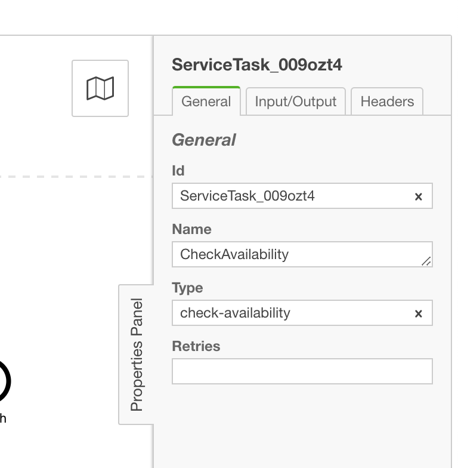
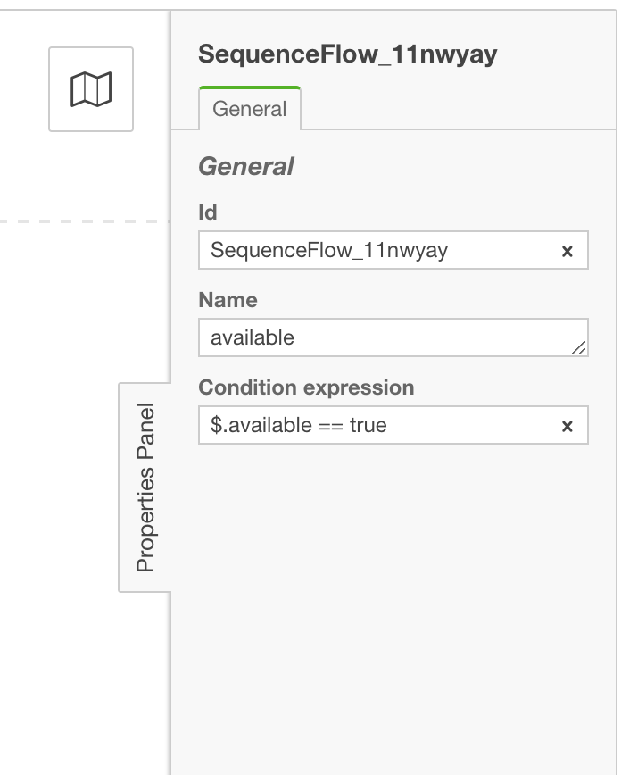
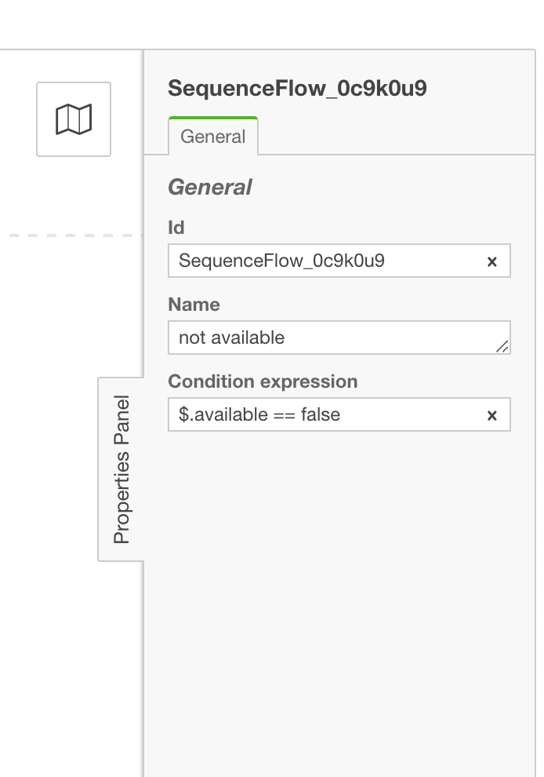

Orquestrando microserviços com zeebe
====================================

Esse código tem apenas fins educacionais.

Workflow da minha loja
======================

##### Painel de propriedades :: Task CheckAvailability

##### Painel de propriedades :: Gateway

